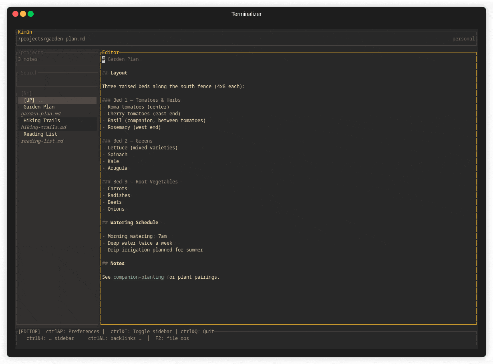
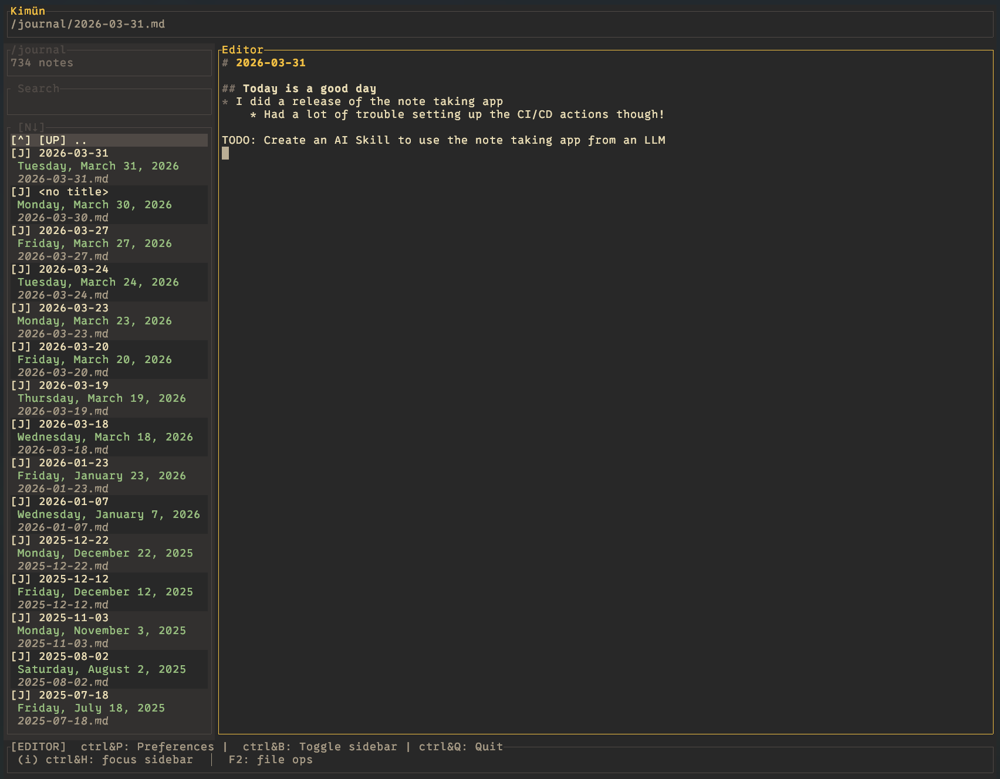

<div align="center">
  

  <h1>Kimün</h1>
  <p><strong>Simple note-taking. Powerful search. AI-ready.**</p>

  <p>
    <a href="https://nico2sh.github.io/kimun/"></a>
    <a href="https://github.com/nico2sh/kimun/blob/main/LICENSE"></a>
    <a href="https://crates.io/crates/kimun_core"></a>
    <a href="https://github.com/nico2sh/kimun/stargazers"></a>
  </p>

  🗣️ <em><strong>Kimün</strong> (Mapudungun): Knowledge, learning, or wisdom.</em>
</div>

---

<div align="center">
  
</div>

---

**Kimün** is a lightweight, blazing-fast, terminal-based notes application focused on ultimate simplicity and robust search. 

It doesn't try to be a bloated, all-in-one life-management suite. Instead, it serves as a minimalist local-first vault that seamlessly weaves into your existing developer terminal environment. Because your notes are stored as plain Markdown files, it plays beautifully alongside tools like Obsidian, Logseq, or QOwnNotes—giving you an ultra-fast TUI/CLI alternative right in your shell.

---

## 📖 Documentation

Ready to dive deeper? Check out our official documentation site for complete user guides, advanced setup steps, and integration tips:

👉 **[Read the Full Documentation Here](https://nico2sh.github.io/kimun/)**

---

## ✨ Key Features & Benefits

* ⚡ **Blazing Fast Search:** Local Markdown files are automatically indexed into a local SQLite database for instantaneous full-text, structured, and fuzzy search.
* 🗺️ **Zettelkasten-Ready Linkages:** Seamlessly navigate your knowledge base using `[[wikilinks]]` and standard Markdown links with intuitive keyboard shortcuts. Includes backlink support with interactive previews!
* 🧠 **AI & MCP Native:** Equipped with a dedicated **Model Context Protocol (MCP) Server** and LLM tools. Let your local or cloud AI models (like Claude Code) scan your notes, run daily reviews, update journals, or synthesize concepts directly.
* 🤖 **Dual Interface Layout:** * **TUI (Terminal User Interface):** An elegant, interactive pane for capturing thoughts, browsing workspaces, and previewing files.
  * **CLI (Command Line Interface):** Fully scriptable. Pipe outputs, log entries via cron jobs, and manipulate entries using `jq` and shell tools.
* 🗂️ **Contextual Workspaces:** Effortlessly separate your notes into distinct contexts (e.g., `Personal` vs `Work`) using multiple independent vaults.
* 🟢 **Embedded Neovim Mode:** Power users rejoice! Utilize standard `HJKL` navigation, native motions, and search-and-replace routines without breaking context.

---

### 📸 TUI Snapshot
<div align="center">
  
</div>

---

## 🚀 Quick Start

### Installation

#### Homebrew (macOS & Linux)
```bash
brew tap nico2sh/kimun
brew install kimun

```

#### Cargo (Rust Ecosystem)

```bash
cargo install kimun-notes

```

### Try It Out!

Explore Kimün immediately using the pre-configured environments located inside the `example/` directory. It comes loaded with interconnected personal and work notes, journals, and incoming inboxes:

```bash
# Launch Kimün in the sample workspace
kimun --vault ./example

```

---

## ⌨️ TUI Keyboard Shortcuts

| Shortcut | Action |
| --- | --- |
| Ctrl + K | Global fuzzy search (Telescope-like) |
| Ctrl + G | Follow `[[wikilink]]` under cursor |
| Ctrl + E | Open Backlinks panel with live preview |
| Ctrl + W | Quick Note — immediately capture thoughts to your inbox |
| F4 | Switch Workspaces (e.g., Toggle Personal / Work) |

---

## 🤖 Automating with CLI & AI (MCP)

### The Power of the CLI

Because Kimün is fundamentally a CLI tool, you can easily pipeline your notes into automation workflows:

```bash
# Quick log to your daily journal from a shell workflow
echo "Finished deploy script successfully" | kimun journal append

# Search your notes structurally
kimun search "refactoring" --json | jq '.[].path'

```

### Model Context Protocol (MCP) & LLMs

Kimün bridges local notes with next-generation AI assistants. Using its native **MCP Server**, AI agents (such as **Claude Code**) can natively view, update, query, and synthesize your thoughts.

* **Scan & Synthesize:** Ask an LLM to read a week's worth of journal logs and pull out action items.
* **Brainstorm:** Ground an agent's reasoning inside your existing knowledge vault to avoid hallucinations.
* **Auto-organize:** Let AI tools suggest unlinked but highly relevant notes.

*(Want to check out or share prompts? See the available definitions in the `/skills` directory!)*

---

## 🗺️ Roadmap & Ecosystem

We are actively building the ultimate developer-first writing interface. Here is what is on the horizon:

* [ ] Universal Command Palette
* [ ] Inline tags & specialized hashtag filtering (`#important`)
* [ ] Native asset handling (pasting images directly into notes)
* [ ] Automatic Markdown list auto-continuation on Enter
* [ ] Enhanced nested section searching

---

## 🤝 Contributing

We love open-source contributions! Whether you want to submit a bug fix, optimize the SQLite indexing, polish the text layout engine, or share an LLM Prompt template/Skill, you are welcome here.

1. Fork the repository.
2. Create your feature branch (`git checkout -b feature/amazing-idea`).
3. Commit your changes (`git commit -m 'Add amazing feature'`).
4. Push to the branch (`git push origin feature/amazing-idea`).
5. Open a Pull Request.

---

## 🏆 Credits & Inspirations

Kimün stands on the shoulders of giants in the terminal and note-taking ecosystem:

* **UI/UX Foundations:** Built with [Ratatui](https://github.com/ratatui/ratatui) & `ratatui-textarea`.
* **Search Mechanics:** Powered by [Nucleo](https://www.google.com/search?q=https://github.com/0x0ac/nucleo) for ultra-fast fuzzy matching, and `ignore` for rapid directory walking.
* **Editor Integration:** Leverages `nvim-rs` for Neovim synchronization workflows.
* **Philosophical Inspiration:** Heavily inspired by Obsidian, Logseq, and QOwnNotes.

---
