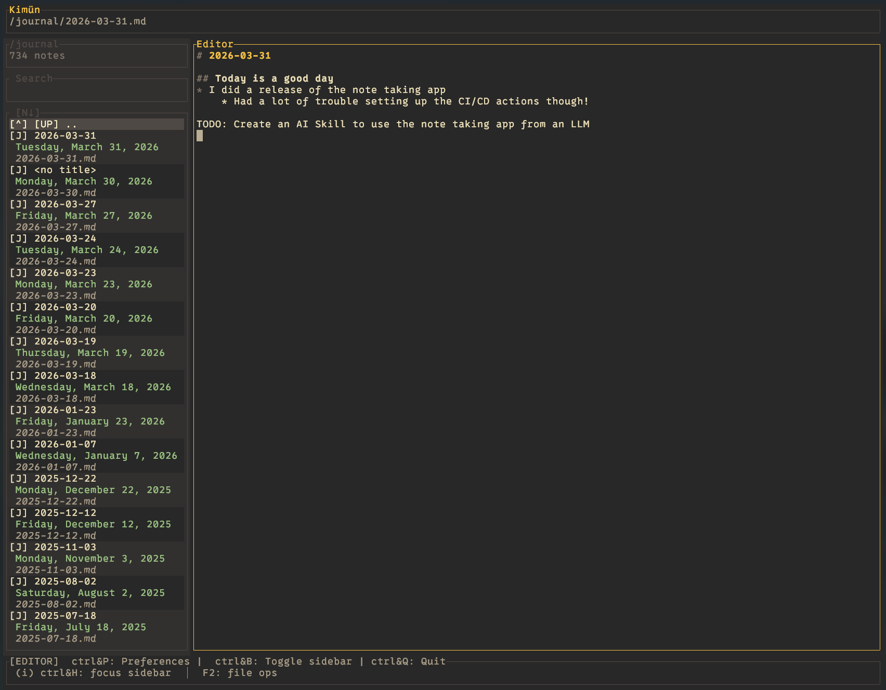

# Kimün

[](https://crates.io/crates/kimun-notes)
[](LICENSE)
[](https://nico2sh.github.io/kimun/)

[](https://ratatui.rs/)

<p align="center">
  
</p>


A terminal-based notes app focused on simplicity and powerful search.

It doesn't try to do everything; there are already more powerful tools for more complex workflows and knowledge management. Kimün aims to be simple and give you the tools to integrate with your own workflow. You can even combine it with other note taking apps that support local notes.

**Check the [docs](https://nico2sh.github.io/kimun/) for more on what you can do with Kimün.**

Notes are plain Markdown files stored in a directory you own. Kimün indexes them into a local SQLite database for fast full-text and structured search.

If you are already using another markdown, local-first, note-taking app, you should feel right at home and be able to use Kimün just like your existing app (QownNotes, Obsidian, Logseq, etc.), only that in this case, it is on your terminal emulator.

## Interactive and cli tool

**TUI** — an interactive terminal interface for writing, browsing, and organizing notes. Navigate your vault, search across notes, follow wiki links, and manage files without leaving the terminal.

**CLI** — a scriptable interface for automation and integration. Pipe output, capture command results into notes, log to your journal from cron jobs, or build custom workflows with `jq` and shell scripts:

```sh
# Quick capture from anywhere
kimun note journal "Fixed the auth bug, deploying at 17:00"

# Pipe command output into a note
./run-tests.sh | tail -5 | kimun note append "logs/test-log"

# Search and process results
kimun search "todo" --format json | jq '.notes[] | {title, path}'
```

The CLI can be used with AI tools and agents. An AI assistant can create, append, and search notes on your behalf — logging findings, organizing research, or updating your journal as part of an automated workflow. You can use the skill located under the [skills](skills/) directory, or create your own (in that case, create a pull request here and share yours!)

> Note: There is a fair amount of AI-assisted code (using Claude) with manual reviews, although most of the core was written with my human hands. Initially for tedious refactors, data structures I'm too lazy to code myself, but also to help me building the foundations of more complex stuff, especially on the UI side. Anyway, I guess the lesson is, use AI as a tool, not as a replacement.



## Quick Start

Kimün is a terminal UI for browsing and editing your Markdown notes with a powerful search engine. Use the TUI to write and organize notes, or the CLI for automation and scripting. Everything is stored as plain `.md` files — no lock-in.

**Homebrew (macOS and Linux):**

```sh
brew tap nico2sh/kimun
brew install kimun
```

**Cargo:**

```sh
cargo install kimun-notes
```

## AI Skills

The `skills/` directory contains ready-made skills for AI coding assistants, so they can use the Kimün CLI on your behalf — capturing notes, appending to your journal, searching your vault, and more.

### Claude Code

```sh
# Copy the skill to your Claude skills directory
cp -r skills/kimun-cli ~/.claude/skills
```

Claude Code will pick it up automatically. In any session, Claude can now create and append notes, log to your journal, and search your vault using the CLI.

### Other AI tools (Codex, Gemini CLI, etc.)

Copy `skills/kimun-cli/SKILL.md` to wherever your tool loads skills from, following that tool's skill installation instructions.

---

## Documentation

Full documentation is available in [`docs/`](docs/content):

- [Getting Started](docs/content/getting-started/)
- [Using Kimün](docs/content/using-kimun/)
- [Guides](docs/content/guides/)

To browse the docs locally with search:

```sh
# Install Zola: https://www.getzola.org/documentation/getting-started/installation/
zola serve docs/
```

## Releasing

Releases are automated via `release.sh`, which uses [`semtag`](./semtag) to determine the next version. Requires [`cargo-edit`](https://github.com/killercup/cargo-edit):

```sh
cargo install cargo-edit
```

```sh
./release.sh           # auto scope (minor or patch based on diff size)
./release.sh -s patch  # force patch bump
./release.sh -s minor  # force minor bump
./release.sh -s major  # force major bump
```

The script will:

1. Calculate the next version from git history
2. Bump the version in `tui/Cargo.toml` (kimun-notes)
3. Commit the change and push a version tag

The tag triggers the CI workflow, which:

- Publishes to crates.io — skipping any crate whose current version is already published
- Pushes a formula to the [homebrew-kimun](https://github.com/nico2sh/homebrew-kimun) tap (final releases only)

**Releasing `kimun_core`:** Core is versioned independently. Update `core/Cargo.toml` and the `kimun_core` entry in the root `Cargo.toml` `[workspace.dependencies]` manually, commit, then run `./release.sh` as usual.

**Required secrets** (set in the repository settings):

- `CARGO_REGISTRY_TOKEN` — crates.io API token
- `HOMEBREW_TAP_TOKEN` — GitHub PAT with write access to `nico2sh/homebrew-kimun`

## Roadmap

- [ ] Command palette
- [ ] Display key shortcuts in command palette and help modal
- [ ] Backlinks panel
- [ ] Inline tags and search by tag (`#important`)
- [ ] Resolve relative paths on links and images
- [ ] Paste images into notes
- [ ] Calendar view for journal browsing
- [ ] Auto-continue list formatting on Enter
- [X] Multiple workspaces
- [X] Search under Markdown sections
- [X] File management (create, rename, move, delete notes and directories)
- [X] Autosave
- [X] Wikilinks in preview
- [X] Navigate notes via links in preview
- [X] Embed neoVim as an option (currently experimental)

# Credits
Built with [Ratatui](https://github.com/ratatui/ratatui) (and [ratatui-textarea](https://github.com/ratatui/ratatui-textarea)), [Nucleo](https://docs.rs/nucleo/latest/nucleo/) for fuzzy searching, [Ignore](https://github.com/BurntSushi/ripgrep/tree/master/crates/ignore) for fast file read.
Inspired by [Obsidian](https://obsidian.md/), [Logseq](https://logseq.com/) and [QownNotes](https://www.qownnotes.org/).
